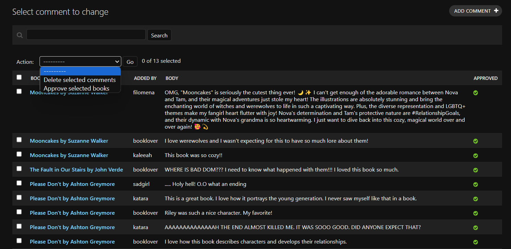

# LoveBooks 
"What if books had a lovely comments sections?"

LoveBooks is a website where readers can write comments about books, and read what other people are saying about the book.

The live project can be viewed [here](https://lovebooks-be86f5983c9b.herokuapp.com/)

## Project Goal

**Goal:** Create a website where readers can comment about their favorite things about books they have read, and see what other people are commenting. 

**USER NEEDS** - The problem and the solution

> "Have you ever read a book that you loved so much that you wanted to talk to everyone about it?"

Sometimes when you finish a good book, two things happen: You want to talk about the things you loved, and you want to see what other people are talking about it. The internet is full of reviews and book platforms, but sometimes you just want to see a really casual, personal impression of a book or share with people a detail that you liked. This is where Lovebooks comes. 

It's a simple, positive website for more personal thoughts about the books that you enjoyed. 

**Results:** BookLover is a website with a book catalogue that can be quickly accessed through searching or browsing and can be improved by adding new books. It has a comment section on book pages that allow users to share comments and view other users comments. 

While creating BookLover, I wanted to create a MVP. What was absolutely necessary (and enough) to make it work?
- Viewing books and comments
- Adding books and comments
- Moderating books and comments
- Do all of that in an easy, intutive way

The result is simple, and yet all features add on each other. The search bar makes browsing books faster, the FAQ and text directs user to how to use the website, the admin panel makes content moderation a relief and the book model allows enough personalization without wasting too much time filling up details. 

Below I explain in detail each feature. 

## Features
- **Homepage** : 

The homepage is the website landing page and dashboard all at once. It consists in four parts:
- Nav Bar
- Header with search bar and site description to introduce user
- Catalogue of books, with navigation. 
- Footer

- **Book Page** :

The book page is where users can see a general description of the books and engage in the comment section. The user must be logged in to leave comments, but the comment box is still visible prompting users to log in and leave their comment. Users can also edit or delete their comments. 

- **FAQ**:

I included on the website points to direct the user to the content. There's the description on the home page, and the suggestions on the comment box. The FAQ ties it all together: It's a simple user manual for BookLover, explaining the concept and listing the features with directions on how to use.

- **Add Book Page**:

After logged in, users can see on the navbar the option to ADD BOOK. This directs them to a simple form-page where they can put details of the book and submit for approval. 

I decided to only use a few details for the book model (title, author, summary and cover) because the goal is to simply identify and give context to the book, so we can have comments about it. This also facilitates the process of users adding new books and populating organically the catalogue. 

- **Other Pages** : 
The website also has sign in, sign up and log out pages that follow the same form-page format. 

- **Details** : 
- The nav bar changes if the user has logged in or not. If not, it gives the option to log in and sign up. If logged in, the user will ADD NEW BOOK and logout.
- There's a message system giving feedback to user actions. For example, if the user types any input not in the database, a message shows up to alert them of that, and directs user to the type of input accepted (title or author name).
- The comment counter on the comment section changes according to the number of comments to accomodate the setence in the plural or singular. 

- **Superuser Admin Panel**: 

I adapted the admin page to better serve the admin needs. A big part of the admin job for LoveBooks is content moderation. This way the superuser can quickly see not approved books and draft books. The admin also has now the action to approve multiple selected books at once. LoveBook should be simple and easy for users and for superusers as well.

- **Superuser Comment Panel**: 

I also adapted the comment page. Now at one glance the admin can look at multiple comments and aprove with one action.

### Future Features
- A like system so users can see first the most interesting (liked) comments about a book, and also browse through most liked books to find new things to read.
- A tag system to books added by users. This would make finding book in a unique way: Users could create a "enemie to lovers" tag and find all books with this type of relationship. This could also lead to "book playlists." Basically all the books with the tag "Books that will make you cry in the showers." 
- A catalogue view with filters to make the process of browsing books even better.

LoveBooks doesn't need these things to function, but it would be fun.

# User Experience

## Design

The design for LoveBooks is a mix of a landing page and a dashboard. I also wanted to make it modern, energetic. So I settled on a mix of dark shades of purple with pink accents (also ties to the love concept). The blue highlights are there to give a more virtual, technologic vibe to the dashboard. 

### Wireframes
I wanted simplicity and I wanted to play with shapes, as well visualize the connection between pages. I did a few experiments on paper and I settled on this configuration.

# Development Process

## Project planning and documentation 

I started by creating a Developer's Diary on a blank doc. I defined my goal with the project and user stories (it's the text I used for project goals here).

**As a an unlogged user, I must be able to:**
- View book pages;
- View comments on book pages; 
- Search book pages;
- Register on the website.

**As a logged user, I must be able to:**
- Add book pages;
- Comment on book pages;
- Delete and edit my comment on book pages;
- Logout from the website.

**As a superuser, I must be able to:**
- Add book pages;
- Approve, edit and delete book pages;
- Comment on book pages;
- Approve user's comments;
- Delete and edit comments on book pages;
- Change website permissions for a user;
- Removing users. 

After this, I added the user stories on a Trello board and used it as reference during development.

## Data Model

I used Google Sheets to plan my models and brainstorm ideas, also to make it clear the type of field used (ManytoOne, OnetoOne, ManytoMany). I wanted to make sure it would have an auto-slug field.

## Manual Testing

### Feature Testing

I tested the project on desktop and mobile, trying all the features and user paths.

User paths tested:
- Homepage -> login -> search books/browse books -> comment on books -> edit comment -> delete comment -> logout
- Homepage -> Sign up -> (same as above)
- Homepage -> login -> add book

Superuse paths tested:
- Admin page -> books -> Filter books, approve/delete books -> book detail -> edit book, delete book, change feature image
- Admin page -> add book 
- Admin page -> comments -> approve/delete comments -> edit, delete comments

I made edits and tested if the superuser could manipulate other users content. The superuser is able to assign a published book as added by different users.

As for the search box, I tried multiple combinations to make sure it would return results as intended. For example, at first drafted books were showing up on the seach, and I adjusted the code to avoid this.

### Detailed Manual Testing

|Page|Feature|Action|Effect|
|---|---|---|---|
|Homepage|Site Logo|Click|Redirects to home page from all pages|
|Homepage|Logged In User Display|Log in as existing user|Username appears in navbar and ADD BOOK|
|Homepage|Home link|Click|Redirects to home page from all pages|
|Homepage|FAQ|Click|Redirects to faq page|
|Homepage|Add book|Click|Redirects to add book page|
|Homepage|Logout link|Click|Redirects to confirm signout page|
|Homepage|Confirm logout|Click 'ok'|Redirects to home page|
|Homepage|Login link|Click|Redirects to Sign In Page|
|Homepage|Register link|Click|Redirects to Sign Up Page|
|Homepage|Search bar|Type book name|Finds book|
|Homepage|Search bar|Type part of a word|Finds books|
|Homepage|Search bar|Type inexistent word "dsdas"|Shows message|
|Homepage|Book details|Click|Opens book page|
|Homepage|Social Media links|Click|All open new page with the correct social media link|
|FAQ|Text collapse button|Click|All buttons collapse|
|FAQ|Text links|Click|All direct to the correct page|
|ADD NEW BOOK|Form text|Type on the fields|All fields work|
|ADD NEW BOOK|Submit button|Click|Adds book to the database|
|ADD NEW BOOK|Add book without image|Not upload image|Placeholder image is displayed|
|BOOK PAGE|Text field|Type on the fields|Field work|
|BOOK PAGE|Submit button|Click|Adds comment to the database and message appears|
|BOOK PAGE|Edit button|Click|Edit comment|
|BOOK PAGE|Delete button|Click|Delete comment|
|BOOK PAGE|Login link|Click|Redirect to login page|
|BOOK PAGE|Comment counter text|1 comment|Displays the text person|
|BOOK PAGE|Comment counter text|2 comment|Displays the text people|
|ADMIN PAGE|Approve comments action|Select/Click|Aproved all comments selected|
|ADMIN PAGE|Approve books action|Select/Click|Aproved all books selected|

### Responsiveness

While creating the project, I checked each feature and page to make sure it would work on different screen sizes. I used the Developer's Tool to do that, as while checking on desktop and mobile. 

### Lighthouse + Color Contrast

I also used Lighthouse to check for potential issues and then I used Siege Media color contrast to adjust colors.

### Code Validation

#### Python code : 
- All python code is validated by both the Flake8 linter (installed in VSCode) and the external CodeInstitute validator @ https://pep8ci.herokuapp.com/. I used Flake8 to scan general error and then paste the code on CI Python Linter to fix it. I adjusted specifically: admin, urls (both), views, models and settings.

#### JavaScript code :
- The JavaScript code in the project was validated using JSHint. I only use javascript for the edit and delete button for the comments, and the code was provided by Code Institute on the CodeStar project.

#### HTML Validation :
- All HTML files in the project were validated using the W3C Narkup Validation Service.
https://validator.w3.org/

|  PAGE | Document checking completed. No errors or warnings to show.  |
| home | yes |
| faq | yes |
| add book | yes |
| book detail | yes |
| login | yes |
| logout | yes  |
| sign in | no, but the only errors are on the text of the imported sign in. I can't modify.|

Sign in Errors

Related to the help text for the password.

#### CSS Validation :
- I pasted the entired CSS code from file style.css on the W3C Validation Service, and received the result "Congratulations! No Error Found."
https://jigsaw.w3.org/css-validator/

# Bugs

I didn't run in any major bugs while creating the project. Most of them were due to typos. I still documented everything that caused a problem in the page loading as expected. 

Problem: The httpresponse page /books wasn't displaying. Fix: Corrected a typo. 
Problem: Book summary on main page was showing text with HTML. Fix: Include the safe filter in index html. {{ book.summary|truncatewords:30|safe }}
Problem: Now book summary was disappearing for certain books. Fix: I decided that truncatewords wasn't as necessary, and the full summary view while browsing books was better user experience.
Problem: "Edit" comment button wasn't being displayed. Fix: Correct the "comment_edit" function identation. 
Problem: Deployment to heroku failed due to "ModuleNotFoundError: No module named 'crispy_forms'". Fix: Change to double quotes the crispy_forms on the installed apps list. 
Problem: Deployment to heroku didn't display css properly. Fix: Run collectstatic again.
Problem: CSS wasn't being displayed on server. Fix: Change DEBUG to TRUE.
Problem: A few posts were displaying a different CSS. Fix: It was the Summernote text box adding html and css, I removed those. (Note: truncatewords might work now, but I don't want to add it anymore.)
Problem: Edit and delete button stopped working. Fix: I needed to adjust the variables to my new class names. 

# Programs Used
1. [Gitpod](https://www.gitpod.io/)
    - I used all my available gitpod hours to finish this project, and a bit more provided by Code Institute.
2. [Heroku](https://www.heroku.com/)
    - Heroku was used to deploy the project terminal.
4. [Github](https://github.com/)
    - Github was used to store the projects after being pushed from Git and its cloud service [Github Pages](https://pages.github.com/) was used to serve the project on the web. GitHub Projects was used to track the User Stories, User Epics, bugs and other issues during the project.
8. [Photoshop]
    - I used Photoshop to create and edit assets fo the project.

# Deployment

## Setting up a cloudinary account for static storage.
1. Navigate to www.cloudinary.com, and click the Sign Up for Free button. Create a new account.
2. Click on Create Account, and click the link in the verification email that you'll be sent.
3. On the Dashboard, copy the API Environment variable somewhere safe - this must be added to the Heroku
configuration variables in the next section.

## Deploying the app on Heroku
1. Log into Heroku and navigate to the Dashboard.
2. Click on the 'New' button.
3. Choose a unique app name, and select the region closest to you.
4. Create a database on Heroku (I elected to stay on Heroku and pay the monthly fee)
    - Click on the Resources tab.
    - Click the Find more add-ons button.
    - Select Heroku Postgres, and click on Install Heroku Postgres.
    - Select a plan (default = Mini @ $5.00 a month, which I'm using), and select your app.
    - Return to Resources tab and click on the Heroku Postgres icon, then select the settings tab and click on Database Credentials. Copy the URI to your clipboard. Paste it to your env.py file using the key "DATABASE_URL". This will allow you to use the same database for development and production.
5. Click the settings tab on the Dashboard, and click the button to Reveal Config Vars. Your database url should be populated here already. Add your Django secret key and your Cloudinary URL (see 1st section above) to the config variables.
Set the PORT to 8000. I also have a GOOGLE-API-KEY config variable to enable Social-Sign-In with Google.
6. In your local repository, add a Procfile to the root directory of the project, containing the following line :  `web: gunicorn lovebooks.wsgi`.
7. Add the url of your Heroku project to the `ALLOWED_HOSTS` list in `settings.py`.
8. Set DEBUG to False, and commit your changes and push to GitHub.
9. In Heroku, navigate to the Settings Tab, and within this the Buildpacks section, and click on Add Buildpack. Select the python buildpack, and save changes.
10. On the Dashboard, select the Deploy tab, and under the Deployment Method heading, select the
GitHub icon to connect your Heroku project to your GitHub repo. Enter your repository name in the text input, and click Search, and then when your repo appears, click Connect.
11. Under the Manual deploy section, click Deploy Branch. You should receive this message - 'Your app was successfully deployed". Click view to see the app running in the browser.

## Making a local clone
1. Open a terminal/command prompt on your local machine.
2. Navigate to the folder on your local machine where you would like to clone the project.
3. Enter the command : `git clone 'https://github.com/jordanabraga/lovebooks.git'`

## Running the app in your local environment
1. Create a virtual enviroment in the new project folder using the command `python3 -m venv venv`
2. Activate the virtual environment : `source venv/bin/activate`
3. Install the project requirements : `pip3 install -r requirements.txt`
4. Create an env.py file containing the following variables (see env.example.py in the root directory of the project for a complete list of variables necessary to run the app) :
    - DATBASE_URL : This is the url generated by Heroku - see [Deploying the app](#deploying-the-app-on-heroku)
    - SECRET_KEY : This is the Django secret key. Choose your own and add it both here and to the Heroku config vars.
    - CLOUDINARY_URL : This is the Cloudinary url set up above.
    - JUST-BEATS-GOOGLE-API-KEY - You need a Google cloud account to get the API key for social sign in.
    - SELENIUM_TEST_USERNAME, SELENIUM_TEST_PASSWORD, SELENIUM_FIXTURE_USERNAME, SELENIUM_FIXTURE_PASSWORD: 
        If you are the project assessor, these settings can be accessed through Code Institute. They are required to run the Selenium tests using the fixtures included in the project. Standard Django automated tests do not require these variables to run.

# Credits

I used Code Institute's Code Star blog project as a reference.

I also researched a few topics and StackOverFlow answers helped me with building this project. Here are the links that I used:
https://ctrlzblog.com/django-models-how-to-automatically-populate-slug-fields-for-urls/
https://ctrlzblog.com/how-to-use-foreign-keys-in-your-django-project/
https://ctrlzblog.com/how-to-add-tags-to-your-blog-a-django-manytomanyfield-example/
https://linuxhint.com/build-a-basic-search-for-a-django/
https://dev.to/thedevtimeline/how-to-add-tags-to-your-models-in-django-django-packages-series-1-3704
https://www.learningaboutelectronics.com/Articles/How-to-create-a-website-that-allows-for-user-generated-posts-with-Python-in-Django.php
https://ordinarycoders.com/blog/article/render-forms-with-django-crispy-forms
https://www.youtube.com/watch?v=VL5ZNCjXEbw&t=311s

A few book covers are fake coves created by me using licence free pictures:
Image by wirestock on Freepik
Image by pvproductions on Freepik
avatar
vecstock
Photo by Rakicevic Nenad
Photo by Faik  Akmd
Photo by Keenan Constance
Photo by Lina Kivaka
Photo by Pavel Danilyuk
Photo by Bruno Bueno

# Acknowledgements

This project was hard to finish because of personal reasons, but at the same time easy to move forward because of the interesting topic. The concepts I've been learning are finally settling in and I'm been able to understand more and more. Creating this was fun, and I can't wait to do more.

I want thank the fellow student Valentino for helping me out with a few questions, and the psyduck tutor who saved me after I struggled with the debug turned false. 